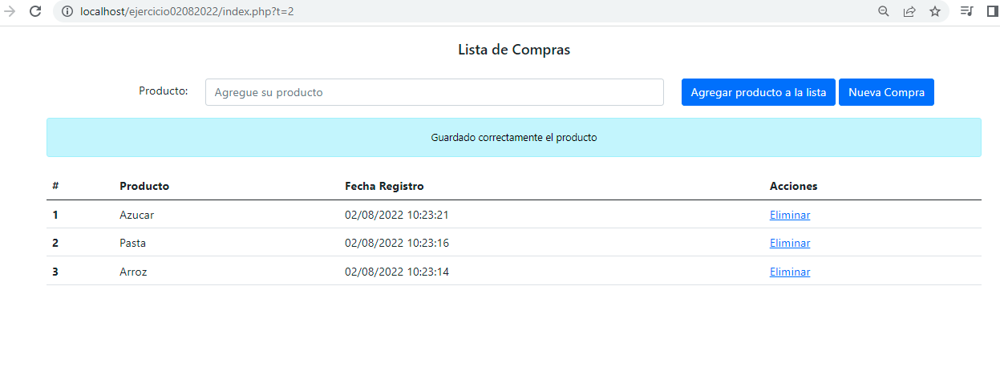

# Ejercicio 02/08/2022

## Se crea proceso para guardar listado de compras, y que los productos agregados se puedan mostrar y eliminar el producto.

## Clonar el proyecto

git clone https://github.com/menesesrigoberto/ejercicio02082022.git

## Se debe crear una base de datos con los nombres que se encuentran en el archivo models/conexion.php
$this->servidor = "localhost";
 
$this->bd = "bdejercicio";
 
$this->usuario = "userejercicio";
 
$this->clave = "Ejercicio_02082022"; 
 

### Proceso

## 1.- Cuando se comienza el proceso se puede crear los productos y se agrega en la base de datos.

## 2.- En la base existe dos tablas: "compra" y "compradetalle"
compra: Se guarda la informacion de la compra de la fecha 
 
compradetalle: Se guardan los productos agregados a la compra

## 3.- El boton de "Nueva Compra", genera una nueva compra y borra los registros anteriores. Es un eliminado logico dentro de la base de datos.

  

